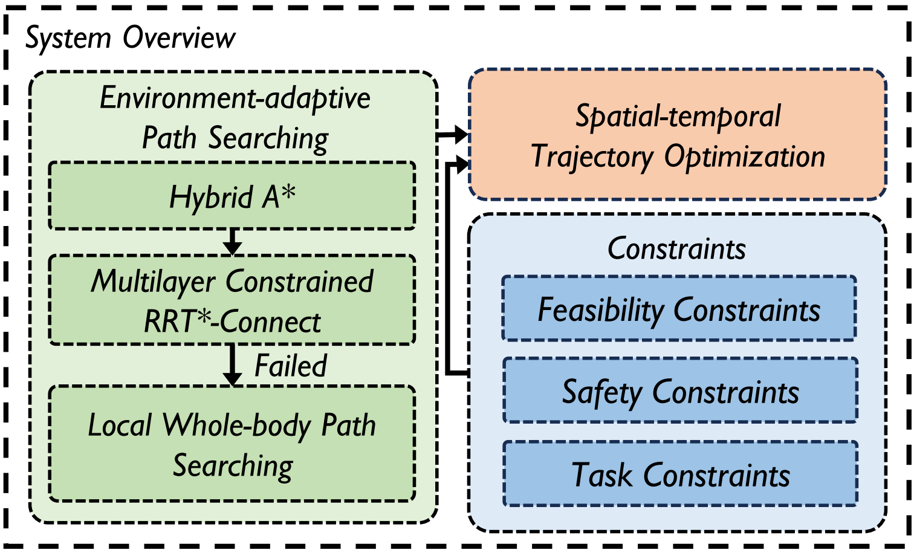
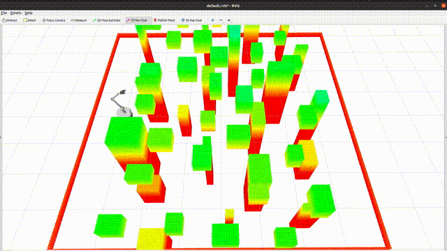
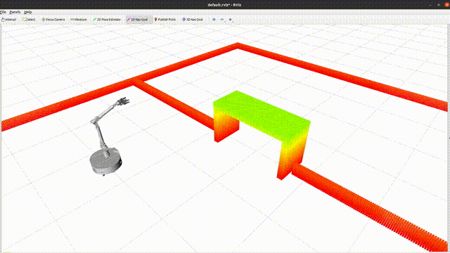
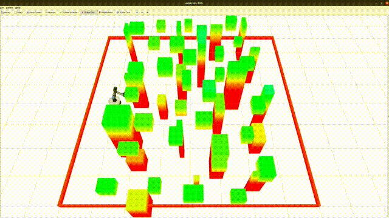
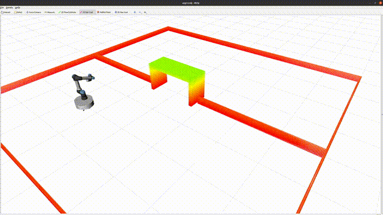

# REMANI-Planner

**RE**al-time Whole-body Motion Planning for Mobile **MANI**pulators Using Environment-adaptive Search and Spatial-temporal Optimization


## News

- **Jan 29, 2024**: REMANI-Planner is accepted to [ICRA 2024](https://2024.ieee-icra.org/).

## Introduction

REMANI-Planner presents a motion planning method capable of generating high-quality, safe, agile and feasible trajectories for mobile manipulators in real time.



**Authors**: [Chengkai Wu](https://chengkaiwu.me/)\*, [Ruilin Wang](https://github.com/Ruilin-W)\*, [Mianzhi Song](http://sysu-star.com/), [Fei Gao](http://zju-fast.com/fei-gao/), [Jie Mei](https://scholar.google.com/citations?user=tyQm5IkAAAAJ&hl=zh-CN) and [Boyu Zhou](http://sysu-star.com/)$^{\dagger}$.

**Institutions**: [SYSU STAR Group](http://sysu-star.com/), [HITSZ MAS Lab](https://hitsz-mas.github.io/mas-lab-website/) and [ZJU FAST Lab](http://zju-fast.com/).

**Video**: [YouTube](https://www.youtube.com/watch?v=iYdAEZ3z11s), [Bilibili](https://www.bilibili.com/video/BV1Wz4y1V7vL).

**Paper**: [Real-time Whole-body Motion Planning for Mobile Manipulators Using Environment-adaptive Search and Spatial-temporal Optimization](https://ieeexplore.ieee.org/document/10610192), 2024 IEEE International Conference on Robotics and Automation (ICRA).

```
@INPROCEEDINGS{10610192,
  author={Wu, Chengkai and Wang, Ruilin and Song, Mianzhi and Gao, Fei and Mei, Jie and Zhou, Boyu},
  booktitle={2024 IEEE International Conference on Robotics and Automation (ICRA)}, 
  title={Real-time Whole-body Motion Planning for Mobile Manipulators Using Environment-adaptive Search and Spatial-temporal Optimization}, 
  year={2024},
  volume={},
  number={},
  pages={1369-1375},
  keywords={Service robots;Dynamics;Transportation;Real-time systems;Planning;Safety;Complexity theory},
  doi={10.1109/ICRA57147.2024.10610192}}
```

If you find this work useful or interesting, please kindly give us a star ⭐, thanks!😀

## Setup

Compiling tests passed on Ubuntu 20.04 with ROS installed.

### Prerequisites

- [ROS](http://wiki.ros.org/ROS/Installation) (tested with Noetic)

```
sudo apt install libompl-dev libeigen3-dev
cd /usr/include
sudo ln -sf eigen3/Eigen Eigen
sudo ln -sf eigen3/unsupported unsupported
```

### Compiling and Running

```
cd ${your catkin workspace}/src
git clone -b master --single-branch https://github.com/SYSU-STAR/REMANI-Planner.git
cd ..
catkin_make -DCMAKE_BUILD_TYPE=Release
```

1. Navigating in dense cuboids map

```
source devel/setup.bash
roslaunch remani_planner exp0.launch
```

You should see the simulation in rviz. You can use the `2D Nav Goal` to send a trigger to start navigation.

<p align="center">
  
</p>


2. Navigating through a bridge

```
source devel/setup.bash
roslaunch remani_planner exp1.launch
```

<p align="center">
  
</p>


## Customize your own Mobile Manipulator (MM)

1. Make the following adjustments in the `remani_planner/mm_config/src/mm_config.cpp` file:
   - Modify the `getAJointTran` function to calculate the homogeneous transformation between different frames of the manipulator.
   - Modify the `setLinkPoint` function to set the position of collision spheres in the respective frame.
   - Modify the `getMMMarkerArray` function based on the urdf file to generate the marker array for MM visualization.
2. Adapt the `mm_param.yaml` file located in the `remani_planner/remani_planner/config/` directory to configure parameters specific to your MM.


**Note**: We have provided an example for the [UR5](https://www.universal-robots.com/products/ur5-robot/) in our code. To use the UR5, simply follow these steps:

1. Open the `mm_param.yaml` file located in the `remani_planner/plan_manage/config/` directory.
2. Locate the `parameter` for `FastArmer` and comment it out by adding a "#" symbol at the beginning of the line.
3. Uncomment the `parameter` for `UR5` by removing the "#" symbol at the beginning of the line.
4. You are now ready to conduct above experiments with a mobile base incorporating the UR5 configuration.

<p align="center">
  
  
</p>

## Acknowledgements

We use [MINCO](https://github.com/ZJU-FAST-Lab/GCOPTER) as our trajectory representation.

We borrow the framework from [AutoTrans](https://github.com/SYSU-STAR/AutoTrans).

We would like to thank colleagues at [Huawei](https://www.huawei.com/en/) for their support for this work: Zehui Meng and Changjin Wang.

## License

The source code is released under the [GPLv3](https://www.gnu.org/licenses/) license.

## Maintenance

For any technical issues, please contact Chengkai Wu([chengkai.wu99@gmail.com](mailto:chengkai.wu99@gmail.com)) or Ruilin Wang(Ruilinin@outlook.com).
