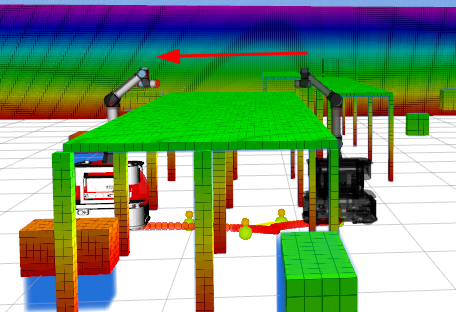
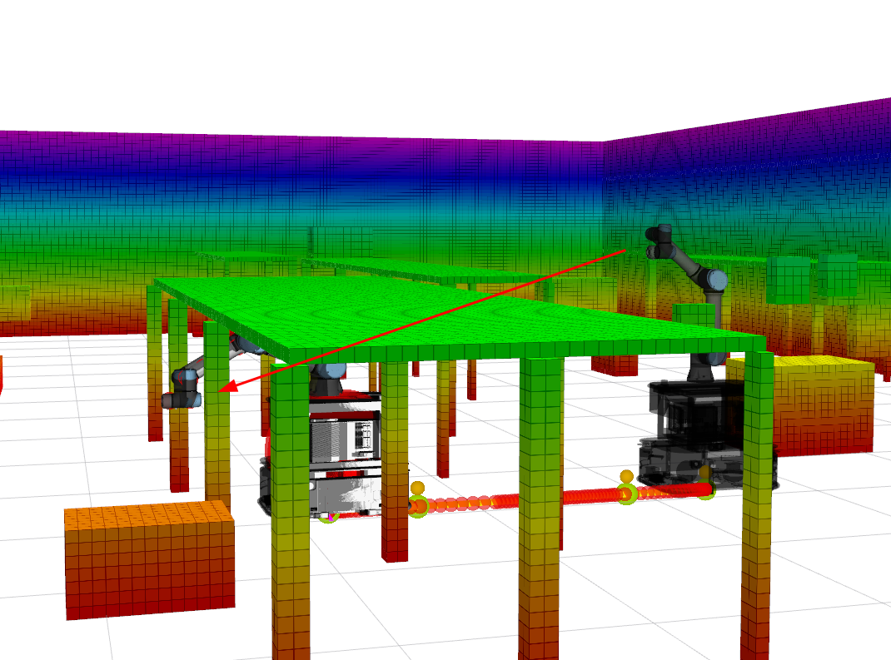
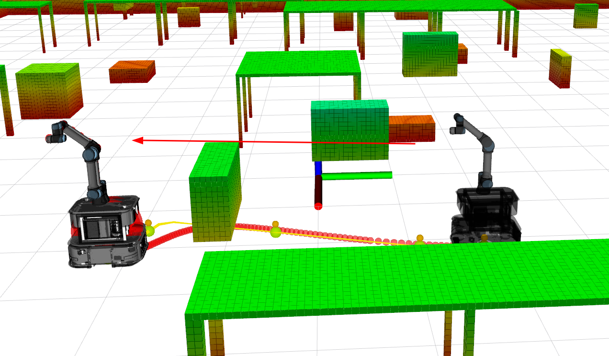

# OCS2 对比

pos: [car_x, car_y, joint_1, joint_2, joint_3, joint_4, joint_5, joint_6] yaw: {car yaw}

## case1 桌面到桌面

start:: pos: [-9.4, 1.8, 0.0, -90.0, 50.0, 40.0, 90.0, 0.0] yaw: 0.0

end::   pos: [-7.2, 1.8, 0.0, -90.0, 50.0, 40.0, 90.0, 0.0] yaw: 180.0

## case2 桌面到桌下

start:: pos: [-10.4, 1.8, 0.0, -90.0, 50.0, 40.0, 90.0, 0.0] yaw: 0.0

end::   pos: [-8.2, 1.8, 0.0, -20.0, 50.0, -30.0, 90.0, 0.0] yaw: 0.0

## case3 箱子障碍物

start:: pos: [2.2, 1.8, 0.0, -90.0, 50.0, 40.0, 90.0, 0.0] yaw: -90.0

end::   pos: [2.2, -2.2, 0.0, -90.0, 50.0, 40.0, 90.0, 0.0] yaw: -90.0
